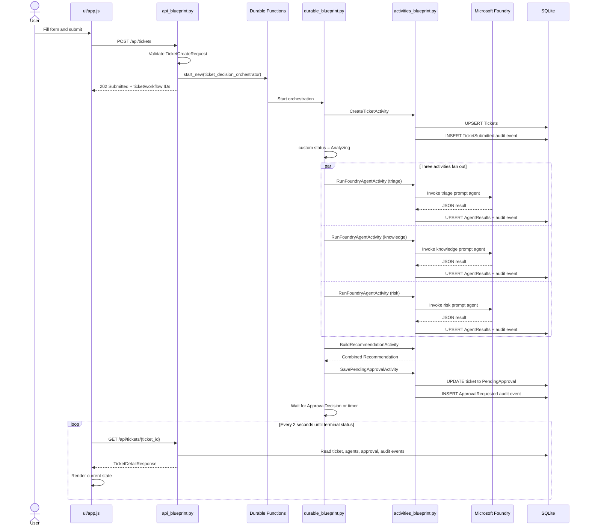
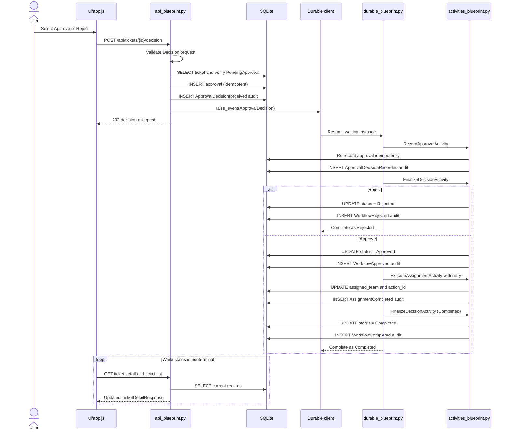

# Application Flow Walkthrough

This document explains the two main user flows from the browser down to Azure
Durable Functions, Microsoft Foundry, and SQLite. It is intended to help a reader
follow the actual code, understand where state changes occur, and explain the
application to someone else.

The Function App starts in [function_app.py](function_app.py). It creates one
`df.DFApp` and registers three blueprints:

- `api_blueprint` from [app/api_blueprint.py](app/api_blueprint.py) exposes HTTP
  endpoints and serves the UI files.
- `durable_blueprint` from
  [app/durable_blueprint.py](app/durable_blueprint.py) coordinates the replay-safe
  workflow.
- `activities_blueprint` from
  [app/activities_blueprint.py](app/activities_blueprint.py) performs database,
  filesystem, current-time, and Foundry operations.

This division is important. A Durable orchestrator can replay, so
`orchestrator_logic()` only schedules durable tasks and makes deterministic
decisions. All I/O happens in HTTP functions or activity functions.

## 1. A user enters ticket information and selects Submit ticket

### End-to-end sequence



### Step 1: Browser form handling

The form is defined in [ui/index.html](ui/index.html) as `#ticket-form`. Its fields
map directly to `TicketCreateRequest`:

| Form field | Request property | Required |
| --- | --- | --- |
| Title | `title` | Yes |
| Description | `description` | Yes |
| Affected service | `affected_service` | No |
| Customer impact | `customer_impact` | No |
| Submitted by | `submitted_by` | No |

[ui/app.js](ui/app.js) registers `submitTicket` as the form's `submit` event
handler. The function:

1. Prevents the browser's normal form submission.
2. Runs browser validation with `reportValidity()`.
3. Disables the submit button and displays `Submitting ticket...`.
4. Reads the form with `FormData` and trims each value.
5. Calls the shared `request()` helper with `POST /tickets`. `request()` prefixes
   the path with `API_ROOT`, so the network request is `POST /api/tickets`.

The JSON request looks like this:

```json
{
  "title": "Payroll team blocked by access errors",
  "description": "Forty payroll specialists receive HTTP 403.",
  "affected_service": "Payroll Portal",
  "customer_impact": "The payroll department cannot process payroll",
  "submitted_by": "payroll.manager@contoso.com"
}
```

### Step 2: HTTP starter validates and starts the workflow

The route decorator on `start_ticket()` in
[app/api_blueprint.py](app/api_blueprint.py) maps `POST /api/tickets` to
`start_ticket_request()` and injects a `DurableOrchestrationClient`.

`start_ticket_request()` performs these operations:

1. `TicketCreateRequest.model_validate(req.get_json())` rejects missing,
   malformed, or extra fields through Pydantic models in
   [app/models.py](app/models.py).
2. `AppSettings.from_environment()` loads configuration such as the approval
   timeout and database path.
3. Two UUIDs are generated: `ticket_id` identifies the business record and
   `workflow_instance_id` identifies the Durable Functions instance.
4. An `OrchestrationInput` is created with the validated ticket, IDs, current UTC
   creation time, and approval timeout.
5. `client.start_new()` starts `ticket_decision_orchestrator`, using
   `workflow_instance_id` as the Durable instance ID.
6. The API immediately returns HTTP `202` with `TicketAcceptedResponse`.

```json
{
  "ticket_id": "generated-ticket-uuid",
  "workflow_instance_id": "generated-workflow-uuid",
  "status": "Submitted"
}
```

At this point, Durable Functions has accepted the orchestration, but the ticket
may not yet exist in SQLite. The API does not write the ticket row itself; the
first activity does that asynchronously.

### Step 3: The UI handles the short persistence race

After receiving `202`, `submitTicket()` resets the form, reports that analysis
has started, refreshes the list, and calls:

```javascript
selectTicket(accepted.ticket_id, { retryNotFound: true });
```

`loadTicketDetail()` can initially receive `404 Ticket not found` because
`CreateTicketActivity` has not run yet. For this post-submit case only, it keeps
the connection indicator online, displays `Ticket accepted. Waiting for workflow
initialization...`, and retries after `POLL_INTERVAL_MS` rather than presenting
the response as an API outage.

This is an eventual-consistency boundary between the HTTP starter and the first
Durable activity, not a failed submission.

### Step 4: The orchestrator creates the business record

Durable Functions invokes `ticket_decision_orchestrator()`, which delegates to
`orchestrator_logic()` in
[app/durable_blueprint.py](app/durable_blueprint.py).

Its first scheduled task is `CreateTicketActivity`. The matching activity
function in [app/activities_blueprint.py](app/activities_blueprint.py) calls
`create_ticket()`:

1. Validates the durable payload as `OrchestrationInput`.
2. Calls `initialize_database()` from [app/db.py](app/db.py).
3. Creates a `TicketRecord` with status `Submitted`.
4. Calls `upsert_ticket()`.
5. Appends a `TicketSubmitted` audit event.

`initialize_database()` opens a short-lived SQLite connection, enables foreign
keys, configures a 5-second busy timeout, enables WAL journal mode, and executes
[sql/schema.sql](sql/schema.sql). The schema uses `CREATE TABLE IF NOT EXISTS`, so
initialization is safe to repeat.

`upsert_ticket()` uses a parameterized `INSERT ... ON CONFLICT(ticket_id) DO
UPDATE`. This makes replaying `CreateTicketActivity` idempotent. The write affects
the `Tickets` table and stores the ticket fields, workflow ID, status, and UTC
timestamps.

`append_audit_event()` writes to `AuditEvents` with the unique deduplication key
`{ticket_id}:submitted`. Its `ON CONFLICT(dedupe_key) DO NOTHING` prevents a
Durable replay from creating duplicate timeline entries.

After the activity returns, the orchestrator sets its **Durable custom status**
to `Analyzing`.

Important distinction: the orchestrator custom status is now `Analyzing`, but
the SQLite `Tickets.status` is still `Submitted`. The regular UI reads the
SQLite-backed ticket endpoints, not `/api/workflows/{instance_id}`, so the ticket
badge can remain `Submitted` while agent analysis runs.

### Step 5: Three Foundry activities run in parallel

`orchestrator_logic()` creates three `RunFoundryAgentActivity` tasks and waits for
all of them with `context.task_all()`:

- `support-triage-agent` chooses category, priority, team, and summarizes why.
- `support-knowledge-agent` proposes troubleshooting steps and a draft response.
- `support-risk-reviewer-agent` identifies risk, concerns, escalation, and whether
  approval is required.

Each invocation enters `run_foundry_agent()` in
[app/activities_blueprint.py](app/activities_blueprint.py). It resolves the
configured Prompt Agent name and Pydantic output contract through
`_agent_contract()`.

In mock mode, `_mock_result()` creates deterministic validated output without a
network call. In real Foundry mode:

1. `_build_agent_prompt()` validates the ticket again and serializes it as compact
   JSON.
2. For the knowledge agent only, the activity reads
   [support_playbook.md](support_playbook.md) and includes it as
   `support_playbook` in the prompt.
3. `invoke_prompt_agent()` in
   [app/foundry_client.py](app/foundry_client.py) creates
   `DefaultAzureCredential`, `AIProjectClient`, and a project-bound OpenAI client
   from `project_client.get_openai_client(agent_name=...)`.
4. `openai_client.responses.create(input=prompt)` calls the Prompt Agent.
5. `_validate_agent_output()` parses `response.output_text` as JSON into
   `TriageAgentResult`, `KnowledgeAgentResult`, or `RiskAgentResult`.

After a valid result returns, the activity calls `upsert_agent_result()` in
[app/db.py](app/db.py). Its parameterized `INSERT ... ON CONFLICT(ticket_id,
agent_name) DO UPDATE` writes one `AgentResults` row per ticket and agent. The row
contains serialized result JSON, confidence, and start/completion timestamps.

The activity also appends an `AgentCompleted` audit event with a per-agent
dedupe key. It returns a small envelope to the orchestrator:

```json
{
  "agent_name": "support-triage-agent",
  "result": {
    "category": "IdentityAccess",
    "priority": "P2",
    "recommended_team": "Identity"
  }
}
```

The actual result contains all fields required by that agent's Pydantic model.

### Step 6: Deterministic recommendation assembly

After all three tasks complete, the orchestrator calls
`BuildRecommendationActivity`. `aggregate_recommendation()` delegates to
`build_recommendation()` in
[app/recommendation.py](app/recommendation.py).

This is ordinary deterministic Python logic, not a fourth AI call. It first
requires exactly one result from each expected agent, revalidates each result,
and builds `Recommendation` as follows:

| Recommendation field | Source |
| --- | --- |
| `category` | Triage agent |
| `priority` | Triage agent |
| `recommended_team` | Triage agent |
| `draft_response` | Knowledge agent |
| `suggested_steps` | Knowledge agent |
| `approval_required` | Risk agent |
| `concerns` | Risk agent |
| `risk_level` | Risk agent |

### Step 7: The ticket becomes pending approval

The orchestrator sends the recommendation to `SavePendingApprovalActivity`.
`save_pending_approval()` validates it and calls `update_ticket_status()` with:

- `status = PendingApproval`
- `recommendation_json = validated recommendation JSON`
- `updated_at = current UTC time`

`update_ticket_status()` performs a parameterized `UPDATE Tickets ... WHERE
ticket_id = ?`. The activity then appends an `ApprovalRequested` audit event and
returns. The orchestrator sets Durable custom status to `PendingApproval`.

The orchestrator now creates two durable tasks:

- `wait_for_external_event("ApprovalDecision")`
- A durable timer at the configured approval deadline

`context.task_any()` pauses until one wins. No Python process or thread must stay
blocked while the workflow waits; Durable Functions persists its history and can
replay the coordinator later.

### Step 8: SQLite data is surfaced back to the UI

The UI reads through two endpoints in
[app/api_blueprint.py](app/api_blueprint.py):

| Endpoint | API helper | SQLite calls | UI use |
| --- | --- | --- | --- |
| `GET /api/tickets` | `list_tickets_request()` | `list_tickets()` selects `Tickets` newest first | Queue, count, status, assigned team |
| `GET /api/tickets/{ticket_id}` | `get_ticket_detail_request()` | `get_ticket()`, `list_agent_results()`, `get_approval()`, `list_audit_events()` | Full detail workspace |

`get_ticket_detail_request()` parses `Tickets.recommendation_json` back into a
validated `Recommendation` and returns `TicketDetailResponse` containing:

- `ticket`
- parsed `recommendation`, if available
- `agent_results`
- `approval`, if available
- ordered `audit_events`
- `workflow_instance_id`

In [ui/app.js](ui/app.js), `renderDetail()` delegates to:

- `renderMetadata()` for service, impact, submitter, team, and timestamps.
- `renderAgentResults()` for the three result cards and confidence values.
- `renderRecommendation()` for priority, category, route, risk, response, steps,
  and concerns.
- `renderAudit()` for the chronological timeline.

`schedulePolling()` waits two seconds and then refreshes both detail and queue
data. It continues while the selected ticket is nonterminal. The approval form is
visible only when SQLite reports `PendingApproval`.

## 2. A user approves or rejects a ticket

### End-to-end sequence



### Step 1: Browser decision handling

The decision form in [ui/index.html](ui/index.html) has `Approve` and `Reject`
buttons with `data-decision` attributes. [ui/app.js](ui/app.js) attaches a click
listener to each button and calls `submitDecision(button.dataset.decision)`.

`submitDecision()` validates the approver field, disables both decision buttons,
and sends:

```http
POST /api/tickets/{ticket_id}/decision
Content-Type: application/json
```

```json
{
  "decision": "approve",
  "approver": "Demo Operator",
  "comments": "Reviewed the recommendation."
}
```

For rejection, only `decision` changes to `reject`.

### Step 2: The HTTP endpoint validates and records receipt

The `submit_decision()` route in
[app/api_blueprint.py](app/api_blueprint.py) delegates to
`submit_decision_request()` with an injected Durable client.

The endpoint performs work in this order:

1. `DecisionRequest.model_validate()` restricts `decision` to `approve` or
   `reject` and requires a nonempty approver.
2. `get_ticket()` selects the `Tickets` row with a parameterized query.
3. A missing ticket returns `404`; a ticket not in `PendingApproval` returns
   `409` and no event is raised.
4. The endpoint generates a `decision_id` UUID and `decided_at` UTC timestamp,
   then creates `ApprovalDecision`.
5. `record_approval()` attempts to write the `Approvals` row.
6. `append_audit_event()` records `ApprovalDecisionReceived`.
7. `client.raise_event()` sends the complete decision payload to the Durable
   instance identified by `ticket.workflow_instance_id`.
8. The endpoint returns HTTP `202` with the generated decision payload.

The API writes the approval **before** raising the event. This preserves evidence
that the user submitted the decision even if delivery to the waiting workflow is
retried.

### Step 3: Approval persistence is idempotent

`record_approval()` in [app/db.py](app/db.py) uses a parameterized `INSERT INTO
Approvals ... ON CONFLICT DO NOTHING`. The schema allows only one approval per
ticket through `UX_Approvals_TicketId` and also makes `decision_id` unique.

After the insert attempt, it selects the ticket's stored approval:

- If the stored `decision_id` matches, the call is an idempotent success.
- If another decision already exists, it raises `IdempotencyConflictError`.
- The HTTP layer accepts an identical repeat by reusing the stored decision.
- A conflicting repeat, such as approving after a rejection was recorded,
  returns `409`.

The `ApprovalDecisionReceived` event uses the stable dedupe key
`{ticket_id}:decision-received`, so repeated delivery does not duplicate that
audit entry.

### Step 4: The external event resumes the orchestration

The event name passed by the API exactly matches the orchestrator's
`wait_for_external_event("ApprovalDecision")`. When the approval task wins the
race, the orchestrator cancels its timeout timer and reads `approval_task.result`.

It then calls `RecordApprovalActivity`. `persist_approval()`:

1. Revalidates the event payload as `ApprovalDecision`.
2. Calls the same idempotent `record_approval()` database helper. Usually this
   finds the row already written by the HTTP endpoint.
3. Appends `ApprovalDecisionRecorded` with a dedupe key containing the decision
   ID.

The two approval writes serve different boundaries: the HTTP write records
receipt, while the activity confirms the durable workflow consumed and validated
the event. Idempotency makes the duplicate write safe.

### Step 5: Reject branch

If `decision == "reject"`, `orchestrator_logic()` chooses terminal status
`Rejected` and calls `FinalizeDecisionActivity` once.

`finalize_decision()` in
[app/activities_blueprint.py](app/activities_blueprint.py):

1. Validates that the requested status is one of `Approved`, `Rejected`, or
   `Completed`.
2. Calls `update_ticket_status()` to set `Tickets.status = Rejected` and update
   the timestamp.
3. Appends the `WorkflowRejected` audit event.

The orchestrator sets its custom status to `Rejected` and returns:

```json
{
  "ticket_id": "...",
  "status": "Rejected"
}
```

No assignment activity runs. `assigned_team` and `action_id` remain unchanged.

The UI's next detail poll sees `Rejected`, hides the approval form, renders the
approval and audit events, and stops polling because `Rejected` is in
`TERMINAL_STATUSES`.

### Step 6: Approve branch and retryable assignment

If `decision == "approve"`, the first `FinalizeDecisionActivity` call sets
`Tickets.status = Approved` and appends `WorkflowApproved`.

The orchestrator then creates `df.RetryOptions` with a 5-second first retry
interval and a maximum of three attempts. It schedules
`ExecuteAssignmentActivity` through `call_activity_with_retry()` with:

```json
{
  "ticket_id": "...",
  "action_id": "assign:{ticket_id}",
  "assigned_team": "the recommendation's recommended_team"
}
```

`execute_assignment()` validates the payload as `AssignmentRequest`, checks the
exact action ID format, reads the current ticket, and requires status `Approved`
or `Completed`.

The optional **Fail next assignment** control is implemented separately in
[app/demo_controls.py](app/demo_controls.py). If armed and no action has yet been
recorded, `consume_fail_next_assignment()` atomically changes its `DemoControls`
row from armed to unarmed and `execute_assignment()` raises the sanitized
`AssignmentActivityError`. Durable Functions then retries according to the
configured policy.

On a normal or retried success, `record_assignment()` performs an atomic,
parameterized update:

```sql
UPDATE Tickets
SET action_id = ?, assigned_team = ?, updated_at = ?
WHERE ticket_id = ? AND action_id IS NULL
```

If the same action was already stored, it returns the existing ticket. If a
different action was stored, it raises `IdempotencyConflictError`. This protects
the final business action from duplicate Durable activity execution.

The activity appends `AssignmentCompleted` with the action ID and assigned team.
The orchestrator then calls `FinalizeDecisionActivity` a second time with status
`Completed`, which updates the ticket and appends `WorkflowCompleted`. Finally,
the orchestrator custom status and output both become `Completed`.

The successful approval status progression visible through SQLite is:

```text
PendingApproval -> Approved -> Completed
```

The rejection progression is:

```text
PendingApproval -> Rejected
```

### Step 7: The UI reflects the decision and stops polling

After the decision endpoint returns `202`, `submitDecision()` displays `Decision
accepted. Workflow is resuming.`, shows a toast, and immediately calls
`loadTicketDetail(..., { quiet: true })`.

The workflow may still be `PendingApproval` on that first read because raising an
external event and running its activities are asynchronous. Existing polling
continues every two seconds and refreshes both:

- The full selected ticket via `GET /api/tickets/{ticket_id}`.
- The queue via `GET /api/tickets`.

As database writes complete, the UI updates without a page reload:

- The status badge changes.
- The approval form disappears once status is no longer `PendingApproval`.
- The approval record appears in the detail response.
- The approved route displays `assigned_team` after assignment succeeds.
- The audit timeline gains receipt, recording, workflow, and assignment events.

Polling stops when status is `Completed`, `Rejected`, `ApprovalTimedOut`, or
`Failed`. The Durable status can also be inspected independently through
`GET /api/workflows/{instance_id}`, which calls `client.get_status()` and returns
the runtime status, custom status, timestamps, and orchestration output.